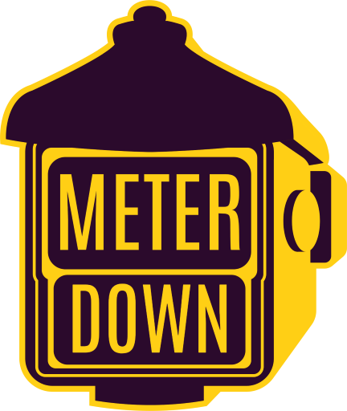

# FSD-MERN-GRP27-METER_DOWN

  

 

### GROUP NUMBER: **27**

### TITLE: **METER DOWN**

### WEBSITE URL:
https://meter-down.herokuapp.com/

 

## Quick Start
Clone the repository:

    git clone https://github.com/vedant080102/FSD-MERN-GRP27-METER_DOWN.git 

 

## FRONTEND- REACT PWA

    cd frontend

Install the dependencies:

    npm install

To start the project run following command in your terminal:

    npm start

To build the project run the following command in your terminal:

    npm run build

 

## BACKEND
In the root folder
 
Install the dependencies:

    npm install

To start the project run following command in your terminal:

    npm run dev

 

## FEATURES:
- Create accounts! - Cabbie Drivers & Passengers
- Book cabs or autos at any time of the day! From anywhere to anywhere
- Mark your pickup and destination on a map!
- Chat with your driver
- Update account data
- View previous rides and fares

## TECHNOLOGIES USED:
- React
- Node.js
- ExpressJs
- Push API
- Socket.io
- Mongoose
- MongoDB
- DummySMS API

### MEMBERS
- VEDANT SARNOBAT (1911117)
- OMKAR SAWANT (1911118)
- ADITYA TAWADE (1911126)
